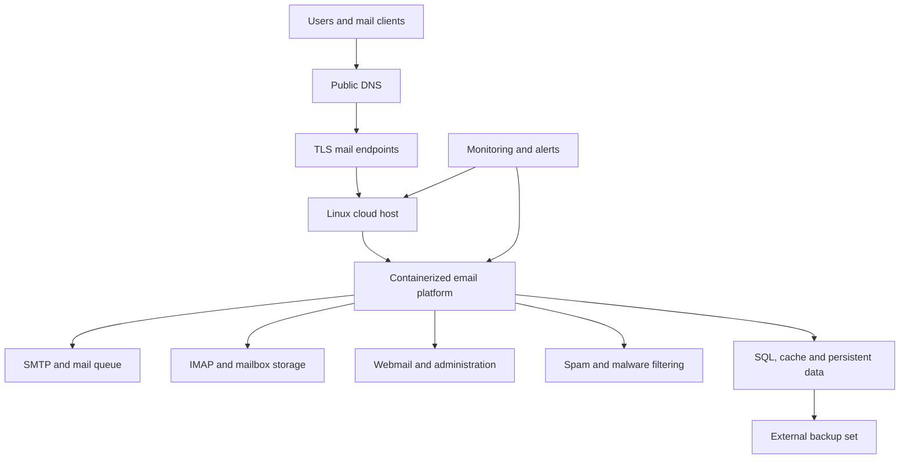

# Self-Hosted Email Platform Engineering Lab

A hands-on DevOps and platform engineering project that documents how I evaluated, deployed and tested several self-hosted email solutions rather than choosing a product from a feature list alone.

This repository brings together my work with **Mailcow, Poste.io, UCS/Nubus and Open-Xchange research**, along with the infrastructure concerns that sit around any real mail platform: Linux, Docker, DNS, security, deliverability, backups, recovery, monitoring and cost.

> **Public-repository notice:** All examples are sanitized. This repository does not contain passwords, API tokens, private keys, mailbox content, customer information, backup archives or reusable production identifiers.

## Why I built this project

I wanted to understand what is actually required to operate a self-hosted business email service. Installing a web interface is the easy part. The difficult parts are reliable delivery, clear administration, safe updates, useful backups, incident visibility and having a recovery process that works when the server is unavailable.

Instead of treating each product as a separate tutorial, I used the same operational questions throughout:

- Can domains and mailboxes be administered without unnecessary complexity?
- Are the administrator and domain-administrator roles clearly separated?
- Can users send and receive mail internally and through external providers such as Gmail?
- How are SPF, DKIM, DMARC, MX, TLS and PTR/rDNS handled?
- What happens when a container, disk, certificate or whole VM fails?
- Can the system be monitored, backed up and restored by someone other than the original installer?
- What is genuinely free, and what still costs money or engineering time?

## What I completed

| Workstream | Current result |
|---|---|
| Mailcow deployment | Installed and operated as a Docker Compose stack |
| Mailcow administration | Tested global administrator, domain administrator, domains and mailboxes |
| Mailcow mail flow | Internal delivery and Gmail inbound/outbound delivery confirmed |
| Poste.io deployment | Domain, mailbox, webmail and public DNS flow tested |
| DNS authentication | MX, SPF and DKIM records queried and validated; DMARC included in the operational design |
| Backup engineering | Mailcow component archives created and validated with Zstandard |
| UCS/Nubus | Configured and reviewed as an identity/groupware-oriented platform |
| Open-Xchange | Feasibility and architecture research completed; implementation is not claimed |
| Cost analysis | Infrastructure, licensing, support and managed-service considerations documented |
| Recovery | Backup integrity confirmed; isolated full restore drill remains the next major test |

## Architecture overview

The detailed design is in [docs/architecture.md](docs/architecture.md).

## Platforms covered

### Mailcow

Mailcow became the main implementation because it provides an integrated administration experience around Postfix, Dovecot, SOGo, Rspamd, MariaDB, Redis, ACME and supporting services. I tested both platform administration and normal mailbox use, then validated public delivery and generated a full component backup set.

Read: [Mailcow implementation](docs/mailcow-implementation.md)

### Poste.io

Poste.io was useful as a simpler all-in-one comparison. I created domains and mailboxes, published the required DNS records, checked webmail and verified external delivery. This gave me a practical comparison instead of relying only on vendor documentation.

Read: [Poste.io implementation](docs/poste-io-implementation.md)

### UCS/Nubus

UCS/Nubus was reviewed from a broader platform perspective. Its value is not only mail; it introduces identity, directory and application-management concepts that are relevant to platform engineering and internal IT services.

Read: [UCS/Nubus evaluation](docs/ucs-nubus-evaluation.md)

### Open-Xchange

I reviewed Open-Xchange as a possible self-hosted groupware and webmail option. The important finding was that OX App Suite is not a complete hosting-style mail administration platform by itself. A usable solution would also require SMTP, IMAP, database, filtering, security and an administration layer. This remained a design exercise and is documented honestly as research.

Read: [Open-Xchange research](docs/open-xchange-research.md)

## Technology and operational areas

- Google Cloud Compute Engine
- Ubuntu Linux
- Docker and Docker Compose
- Postfix, Dovecot and SOGo
- MariaDB/MySQL and Redis
- Rspamd and malware-filtering concepts
- Cloudflare DNS
- SMTP, IMAP, HTTPS and TLS
- MX, SPF, DKIM, DMARC and PTR/rDNS
- Zstandard backup archives
- VM snapshots and recovery planning
- Uptime, capacity, queue, certificate and backup monitoring
- Security hardening, incident handling and runbooks

## Repository guide

| Path | What it contains |
|---|---|
| [docs/architecture.md](docs/architecture.md) | Component architecture and message flow |
| [docs/platform-comparison.md](docs/platform-comparison.md) | Practical comparison and selection reasoning |
| [docs/mailcow-implementation.md](docs/mailcow-implementation.md) | Mailcow implementation record |
| [docs/poste-io-implementation.md](docs/poste-io-implementation.md) | Poste.io implementation record |
| [docs/ucs-nubus-evaluation.md](docs/ucs-nubus-evaluation.md) | UCS/Nubus evaluation |
| [docs/open-xchange-research.md](docs/open-xchange-research.md) | Open-Xchange feasibility design |
| [docs/dns-and-deliverability.md](docs/dns-and-deliverability.md) | Public DNS and delivery checks |
| [docs/backup-and-recovery.md](docs/backup-and-recovery.md) | Backup validation and restore plan |
| [docs/security-and-monitoring.md](docs/security-and-monitoring.md) | Hardening and observability baseline |
| [docs/operations-runbook.md](docs/operations-runbook.md) | Routine checks and incident workflow |
| [docs/pricing-and-licensing.md](docs/pricing-and-licensing.md) | Honest cost and licensing model |
| [docs/lessons-learned.md](docs/lessons-learned.md) | Decisions, gaps and next improvements |
| [scripts/health-check.sh](scripts/health-check.sh) | Read-only Docker/host health check |
| [scripts/verify-backups.sh](scripts/verify-backups.sh) | Backup archive verification helper |

## Evidence and boundaries

During the lab I confirmed:

- the required containers reached running/healthy states;
- domains and mailboxes could be administered;
- administrator and domain-administrator responsibilities behaved differently;
- internal mailbox delivery worked;
- Gmail inbound and outbound delivery worked;
- MX, SPF and DKIM records resolved publicly;
- backup component archives were created;
- every generated `.tar.zst` file passed a Zstandard integrity test.

I do **not** claim that archive validation alone proves disaster recovery. A backup becomes operationally trusted only after a complete restore into an isolated environment and a functional check of accounts, messages, authentication and mail services.

## Skills demonstrated

- requirements analysis and technical comparison;
- Linux server administration;
- Docker Compose service operations;
- cloud networking and DNS troubleshooting;
- email authentication and delivery diagnostics;
- role, domain and mailbox administration;
- backup validation and recovery planning;
- security-aware documentation;
- monitoring and incident-readiness design;
- cost, licence and support analysis;
- communicating technical trade-offs without hiding unfinished work.

## Next milestones

- [ ] Restore the Mailcow backup on an isolated test VM.
- [ ] Measure actual recovery time and confirm the achievable RTO.
- [ ] Confirm the backup schedule against an agreed RPO.
- [ ] Add alerts for disk, memory, containers, mail queue, TLS expiry and backup age.
- [ ] Complete a controlled update and rollback exercise.
- [ ] Add carefully redacted screenshots.
- [ ] Automate repeatable infrastructure tasks where this improves safety.

## Author

**Pabasara Meegahakumbura**  
DevOps | SRE | Platform | Cloud | Linux and IT Operations

- [Portfolio](https://pabasarameegahakumbura.github.io/pabaops-portfolio/)
- [GitHub](https://github.com/PabasaraMeegahakumbura)
- [LinkedIn](https://www.linkedin.com/in/pabasara-meegahakumbura/)

## Disclaimer

This is a portfolio-safe engineering record, not a copy of a customer or employer environment. Details that could expose a real system have been removed or generalized.
