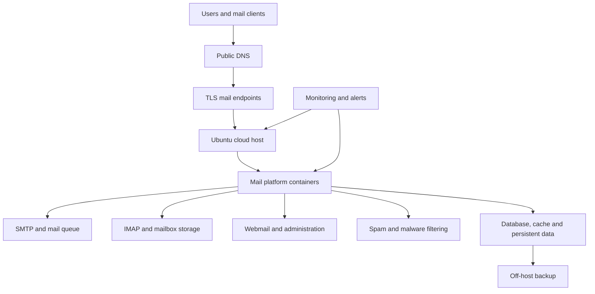

# Self-Hosted Email Platform Engineering Lab

A structured DevOps and platform-engineering repository based on my hands-on work with **Mailcow, Poste.io and UCS/Nubus**, together with an **Open-Xchange feasibility study**.

The repository is organized like an operational project rather than a long tutorial. Each platform has its own folder containing its scope, implementation notes, command reference and troubleshooting guidance. Shared topics such as DNS, security, monitoring, backups and incident response are kept separately so they can be reused across platforms.

> **Security notice:** All public examples are sanitized. No passwords, tokens, private keys, mailbox content, customer data, backup archives or reusable production identifiers are included.

## What was completed

| Workstream | Evidence-based status |
|---|---|
| Mailcow | Implemented, administered and tested with internal and Gmail mail flow |
| Poste.io | Implemented and tested with domain, mailbox, DNS and external delivery checks |
| UCS/Nubus | Configured and evaluated from an identity/platform perspective |
| Open-Xchange | Researched and designed only; no deployment is claimed |
| DNS authentication | MX, SPF and DKIM queried; DMARC and PTR/rDNS included in the operating design |
| Mailcow backup | Component archives created and all reported `.tar.zst` files passed Zstandard integrity testing |
| Full recovery | Planned next milestone; archive integrity is not presented as a completed restore |

## Start here

1. Read the [project overview](docs/00-project-overview/README.md).
2. Review the [architecture](docs/01-architecture/README.md).
3. Choose a platform folder:
   - [Mailcow](docs/02-platforms/mailcow/README.md)
   - [Poste.io](docs/02-platforms/poste-io/README.md)
   - [UCS/Nubus](docs/02-platforms/ucs-nubus/README.md)
   - [Open-Xchange research](docs/02-platforms/open-xchange/README.md)
4. Use the [shared services](docs/03-shared-services/README.md) for DNS, security and monitoring.
5. Use the [operations section](docs/04-operations/README.md) during routine work or incidents.
6. Review [costs and decisions](docs/05-costs-and-decisions/README.md).

## Repository structure

```text
self-hosted-email-platform-lab/
├── README.md
├── LICENSE
├── docs/
│   ├── README.md
│   ├── 00-project-overview/
│   │   └── README.md
│   ├── 01-architecture/
│   │   └── README.md
│   ├── 02-platforms/
│   │   ├── mailcow/
│   │   │   ├── README.md
│   │   │   ├── 01-installation.md
│   │   │   ├── 02-administration.md
│   │   │   ├── 03-command-reference.md
│   │   │   ├── 04-backup-and-recovery.md
│   │   │   └── 05-troubleshooting.md
│   │   ├── poste-io/
│   │   │   ├── README.md
│   │   │   ├── 01-implementation.md
│   │   │   ├── 02-command-reference.md
│   │   │   └── 03-troubleshooting.md
│   │   ├── ucs-nubus/
│   │   │   ├── README.md
│   │   │   ├── 01-platform-operations.md
│   │   │   └── 02-troubleshooting.md
│   │   └── open-xchange/
│   │       ├── README.md
│   │       └── 01-proposed-poc.md
│   ├── 03-shared-services/
│   │   ├── README.md
│   │   ├── dns-and-deliverability.md
│   │   ├── security-hardening.md
│   │   └── monitoring-and-alerting.md
│   ├── 04-operations/
│   │   ├── README.md
│   │   ├── daily-weekly-monthly-checks.md
│   │   ├── incident-response.md
│   │   ├── backup-and-restore-standard.md
│   │   └── troubleshooting-index.md
│   └── 05-costs-and-decisions/
│       ├── README.md
│       ├── platform-comparison.md
│       ├── pricing-and-licensing.md
│       └── lessons-learned.md
├── scripts/
│   ├── common/
│   │   ├── host-health-check.sh
│   │   ├── dns-health-check.sh
│   │   └── verify-zstd-backups.sh
│   └── mailcow/
│       └── compose-health-check.sh
└── evidence/
    └── README.md
```

## Architecture at a glance



## Main engineering outcomes

- worked with administrator, domain-administrator, domain and mailbox workflows;
- confirmed internal mailbox delivery;
- confirmed two-way Gmail mail flow;
- queried public MX, SPF and DKIM records;
- reviewed DMARC rollout and PTR/rDNS requirements;
- inspected Docker Compose services and component logs;
- generated Mailcow component backups;
- verified all reported Zstandard archives;
- documented security, monitoring, incident response and cost boundaries;
- kept unfinished work, especially the isolated restore drill, clearly identified.

## Safe command policy

Commands are labelled by purpose and risk. Read-only diagnostic commands are separated from commands that change service state. Examples use placeholders such as `example.com` and TEST-NET IP addresses. Always confirm the working directory, platform version and backup status before running change commands.

## Portfolio value

This project demonstrates more than installation. It shows requirements analysis, Linux operations, Docker troubleshooting, DNS and deliverability, role delegation, backup engineering, recovery thinking, security, monitoring, cost analysis and honest technical documentation.

## Author

**Pabasara Meegahakumbura**  
DevOps | SRE | Platform | Cloud | Linux and IT Operations

- [Portfolio](https://pabasarameegahakumbura.github.io/pabaops-portfolio/)
- [GitHub](https://github.com/PabasaraMeegahakumbura)
- [LinkedIn](https://www.linkedin.com/in/pabasara-meegahakumbura/)
