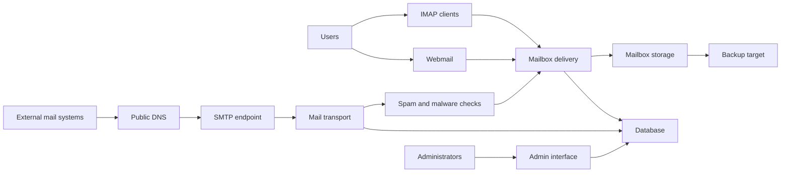

# Architecture

## Logical component view

## Host layer

The lab uses an Ubuntu cloud VM. The host owns networking, firewall rules, time, packages, Docker, filesystems and persistent disks. The VM is treated as replaceable; application state must therefore be recoverable outside the host.

## Platform layer

The platform provides SMTP, IMAP, webmail, administration, filtering, database, cache, TLS and storage functions. Mailcow exposes these as multiple Compose services. Poste.io presents a more consolidated product. UCS/Nubus adds identity and application-platform considerations.

## DNS layer

Public DNS connects the domain to the service and publishes sender identity. Mail traffic depends on A/AAAA, MX, SPF, DKIM, DMARC and PTR/rDNS behaving consistently.

## Availability boundary

The implemented design is a single-node lab. It is not automatic HA. Recovery depends on known configuration, off-host backups, snapshots, monitoring and a tested restore procedure.
