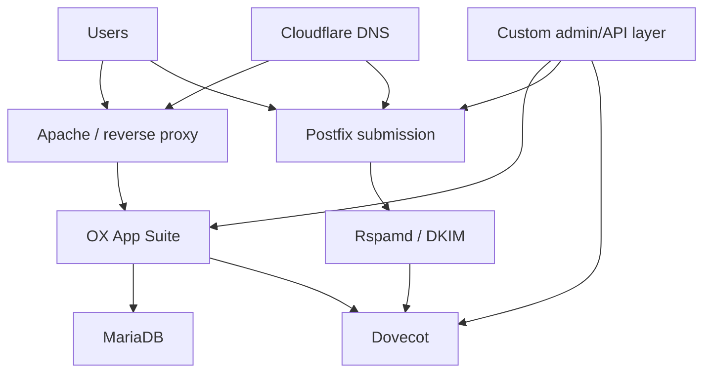

# Proposed Open-Xchange POC

## Architecture



## Proposed components

- GCP VM;
- Ubuntu Linux;
- Apache;
- Open-Xchange App Suite;
- MariaDB;
- Postfix;
- Dovecot;
- OpenDKIM or equivalent;
- Rspamd;
- Fail2ban/firewall;
- Cloudflare DNS;
- custom administration/API layer.

## Proposed host discovery commands

These would be appropriate before a POC but do not represent a completed OX deployment:

```bash
hostnamectl
cat /etc/os-release
free -h
df -h
ss -lntup
systemctl --failed --no-pager
apache2ctl -S 2>/dev/null
```

## POC stages

1. confirm supported OS and repositories;
2. design DNS and TLS;
3. install database and OX components;
4. configure reverse proxy;
5. integrate Postfix/Dovecot;
6. configure signing/filtering;
7. build domain/user provisioning;
8. test webmail, IMAP and SMTP;
9. add backups and monitoring;
10. document support and upgrade boundaries.

## Main risk

The custom administration and integration layer becomes software that must be secured, tested and maintained. This makes the POC a larger platform-engineering project than deploying an integrated mail suite.
