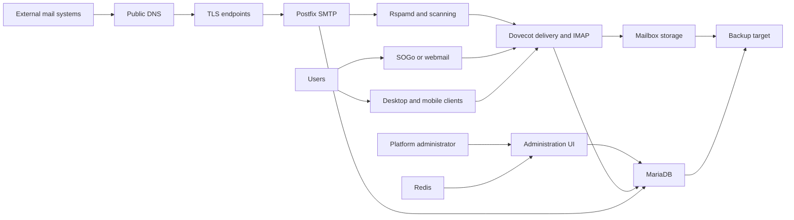

# Architecture and Mail Flow

## Design goal

The lab was designed around a small production-style email service hosted on a Linux VM. The platform had to provide mail transport, mailbox access, webmail, administration, filtering, TLS and persistent storage while remaining understandable enough to operate during an incident.

## Logical architecture



## Infrastructure layers

### 1. Cloud and host

The base layer is a cloud VM running Ubuntu Linux. The host provides CPU, memory, persistent disk, networking, firewall controls, time synchronization, package management and the Docker runtime.

The VM is deliberately treated as replaceable. Mail data, configuration, cryptographic material and database state must therefore be covered by a separate backup and recovery process.

### 2. Container platform

Docker Compose provides the service lifecycle. It makes the application components visible as separate services and gives a consistent way to start, stop, update, inspect and troubleshoot the stack.

Useful operational views include:

```bash
docker compose ps
docker compose logs --tail=100
docker stats --no-stream
docker inspect <container-name>
```

These commands are useful evidence, but a list of running containers is only the start of a health assessment. Mail flow, authentication, queue state, storage, certificates and backups must also be checked.

### 3. Mail transport and access

- **Postfix** accepts and relays SMTP traffic.
- **Dovecot** provides mailbox delivery and IMAP access.
- **SOGo or the platform webmail** provides a browser-based user experience.
- **Rspamd and related scanners** evaluate messages and support spam/malware controls.
- **MariaDB/MySQL** holds platform configuration and account-related data.
- **Redis** supports cache and temporary application state.
- **ACME/TLS services** automate certificate handling where supported.

### 4. DNS and trust

The public DNS layer controls how other systems find and evaluate the service:

- **A/AAAA** maps the mail hostname to the server.
- **MX** tells other systems where to deliver domain mail.
- **SPF** states which systems are allowed to send for the domain.
- **DKIM** publishes the public key used to verify signed messages.
- **DMARC** defines policy and reporting for SPF/DKIM alignment.
- **PTR/rDNS** associates the sending IP with the mail hostname and normally requires the cloud/provider side to configure.

Cloudflare can host the DNS records, but mail records must not be treated like ordinary proxied web traffic. Mail host records are normally DNS-only unless a specifically supported proxy service is being used.

## Message flow

### Inbound

1. An external sender looks up the recipient domain's MX record.
2. The sender connects to the published SMTP endpoint.
3. TLS is negotiated when supported.
4. Postfix accepts the message according to policy.
5. Filtering and scanning evaluate the message.
6. Dovecot delivers accepted mail to the user's mailbox.
7. The user reads it through webmail or an IMAP client.

### Outbound

1. A user submits mail using authenticated SMTP or webmail.
2. The platform checks the account and submission policy.
3. The message is filtered and DKIM-signed.
4. DNS is used to locate the receiving domain.
5. The remote server evaluates the sending IP, PTR/rDNS, SPF, DKIM, DMARC and reputation.
6. The delivery result is written to the mail logs and queue state.

## Availability boundary

The implemented lab uses a single primary VM. This is not automatic high availability. A host, disk or region incident can interrupt service until the system is repaired or restored.

For this design, resilience comes from:

- off-server backups;
- cloud snapshots as an additional recovery mechanism;
- documented configuration;
- monitoring and alerting;
- a tested rebuild/restore procedure;
- clear RTO and RPO expectations.

## Security boundary

Only required public services should be reachable. Administration should be protected separately from normal user traffic. Secrets and private keys must not be stored in this repository, screenshots or shell history.

The architecture is intentionally vendor-neutral at the outer layers. Mailcow and Poste.io package components differently, but both still depend on sound host security, DNS, storage, backup and operational ownership.
