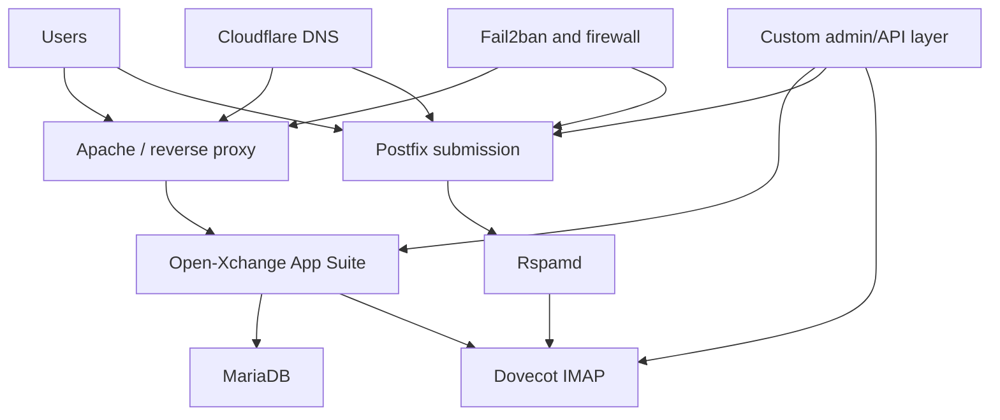

# Open-Xchange Feasibility Research

## Question investigated

Could Open-Xchange be used as a self-hosted replacement for a complete mail-hosting platform?

## Key finding

OX App Suite provides the user-facing groupware and webmail experience, but it should not be treated as a complete cPanel-, Poste.io- or Mailcow-style hosting control plane by itself.

A complete service would still require supporting infrastructure and integration.

## Proposed proof-of-concept architecture

Proposed components:

- GCP VM;
- Ubuntu Linux;
- Open-Xchange App Suite;
- MariaDB;
- Apache;
- Postfix;
- Dovecot;
- OpenDKIM or equivalent signing;
- Rspamd;
- Fail2ban/firewall controls;
- Cloudflare DNS;
- a custom administration/API layer.

## Why the administration layer matters

A hosting provider needs more than a user inbox. It needs reliable workflows for:

- domain creation;
- mailbox provisioning;
- aliases and groups;
- quotas;
- password/reset administration;
- suspension and deletion;
- tenant-level delegation;
- audit and support access.

If these functions are not available as a coherent control plane, they must be assembled through APIs or custom tooling. That increases development, security and maintenance responsibility.

## Risks identified

- integration complexity across many independently updated components;
- unclear support boundary when one component fails;
- additional custom code for provisioning and administration;
- more complicated backup consistency;
- upgrade compatibility between the groupware, database and mail layers;
- licensing/support terms that require direct confirmation;
- higher operational effort than an integrated platform.

## Status

This work remained a feasibility study and architecture plan. I did not present the proposed OX environment as deployed or production-tested. The research was still valuable because it prevented a user-facing groupware product from being incorrectly selected as a complete hosting platform.
